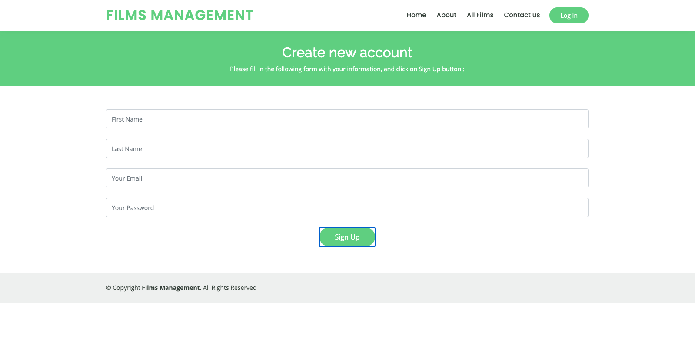
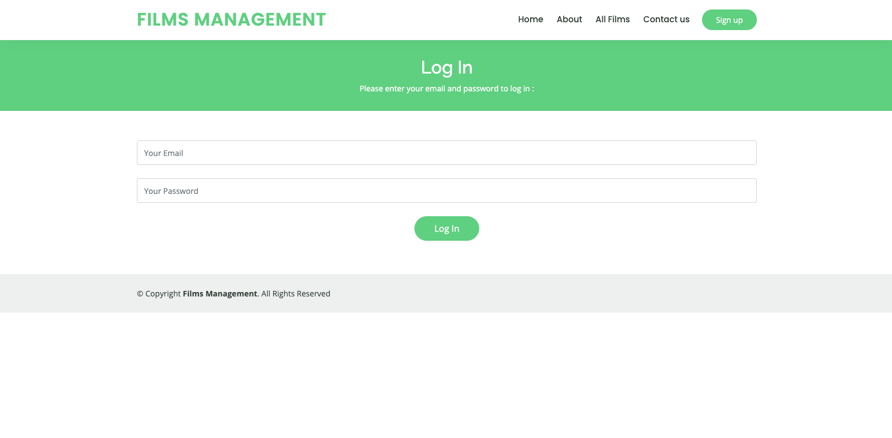
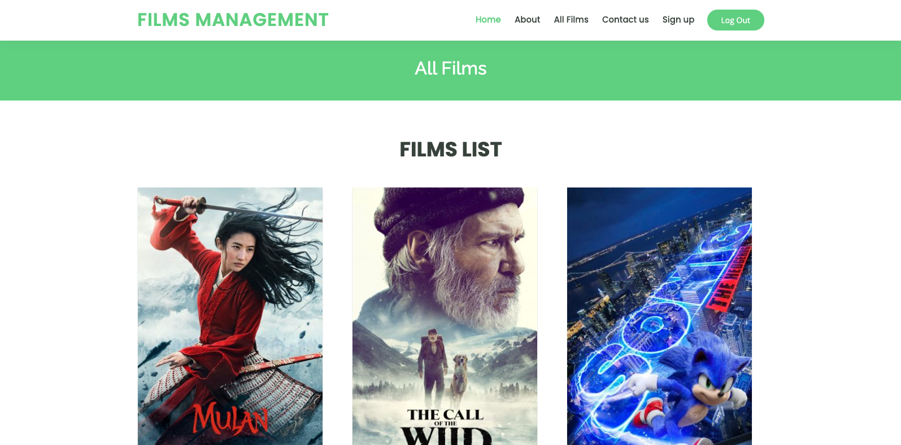
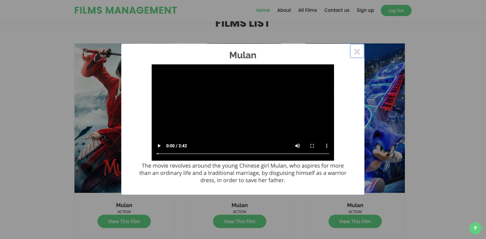
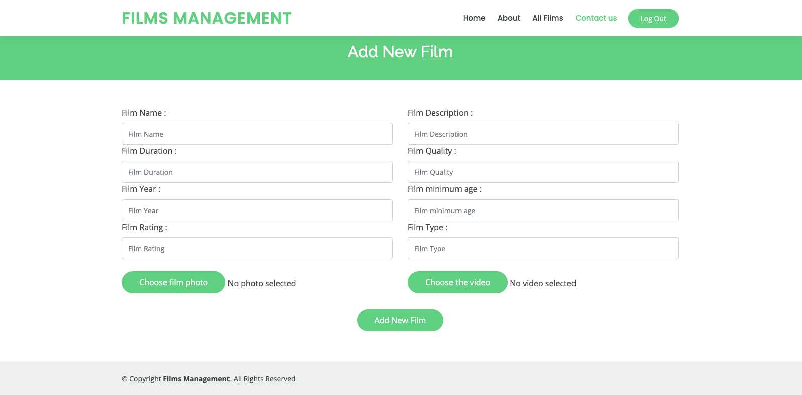
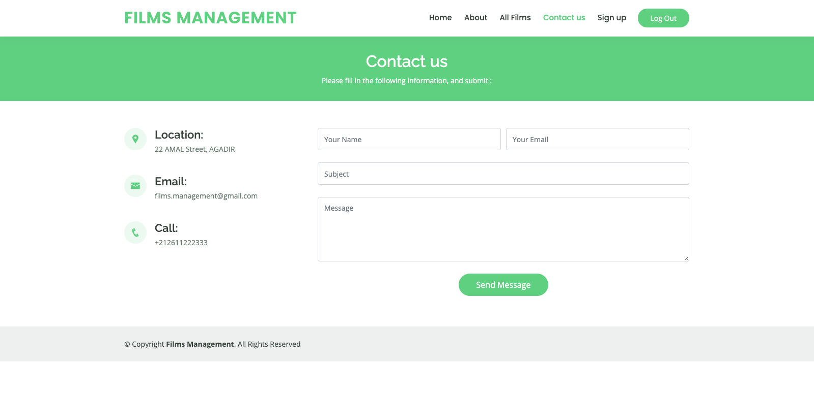

# FilmsManagement
> A web application of films management built with SparkJava and Cayenne


## Description
This project is a web application of films management, there are two users, the admin who manage the website (manage films), and the client who can create an account and log in to watch films.

## Built With
* [Gson](https://github.com/google/gson)
* [SparkJava](https://sparkjava.com)
* [Apache Cayenne](https://cayenne.apache.org/)
* [Oracle Database 12c](https://www.oracle.com/database/12c-database)
* [Fusionauth-jwt](https://github.com/FusionAuth/fusionauth-jwt)
* [Axios](https://github.com/axios/axios)
* [JQuery](https://jquery.com)
* [Bootstrap](https://getbootstrap.com)
* [SweetAlert2](https://sweetalert2.github.io/)

## Screenshots

>Register :


>Log in :


>View the films list :


>Watch the film :


>Add a new film :


>Contact us :


## How To Run

+ Install IntelliJ IDEA IDE : https://www.jetbrains.com/idea
+ Install JDK 8 : https://www.oracle.com/java/technologies/javase/javase-jdk8-downloads.html
+ Install Oracle Database 12c : https://www.oracle.com/database/12c-database/
+ Edit the file cayenne-project.xml with the oracle database information :
```xml
<data-source>
    <driver value="oracle.jdbc.driver.OracleDriver"/>
    <url value="jdbc:oracle:thin:@localhost:1521/xe"/>
    <connectionPool min="1" max="1"/>
    <login userName="system" password="oracle"/>
</data-source>
```

+ Edit the file Settings.java :
```java
package com.films.management.settings;

public class Settings {
    //TODO: Enter the email address here
    public static String email = "";
    //TODO: Enter the email password here
    public static String password = "";
    //TODO: Enter a secret key here (for the JWT token encoding) 
    public static String secret = "";
}
```
+ Run the Back-End application (Application.java).

+ Open the url : http://localhost:8000/index.html in the browser.

## License
[MIT License](https://choosealicense.com/licenses/mit)

## Contact
- Salma Halla - salma.halla.2000@gmail.com
- Hamza Jerdouj - jerdouj.ha@gmail.com
